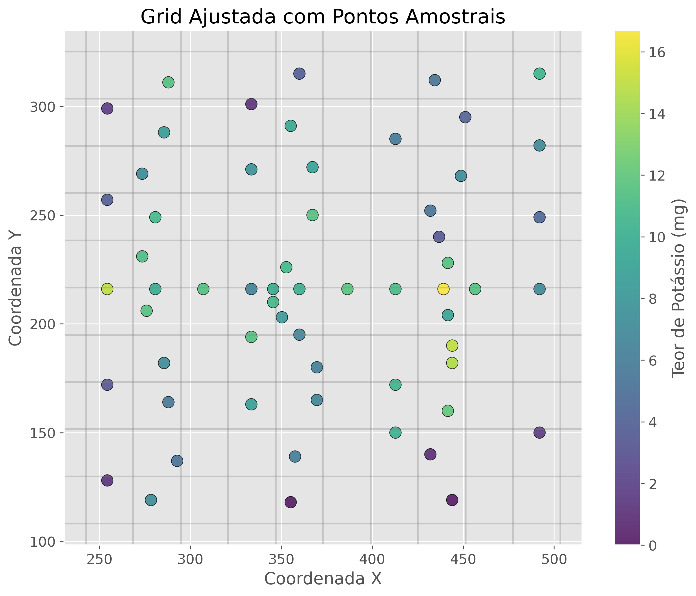

# Relatório Final - Análise Geoestatística do Teor de Potássio

**Autor: Pedro Henrique Silva - 18101395**

*Universidade Federal de Santa Catarina*

*Trabalho Final de Geoestatística*

*Data: 01/07/2025*

## 1. Introdução

Este trabalho apresenta uma análise geoestatística completa de um conjunto de dados referentes ao teor de potássio (K) em um depósito mineral. O potássio é um elemento químico essencial para diversos processos biológicos e industriais, sendo amplamente utilizado na agricultura como fertilizante. Em depósitos minerais, o potássio geralmente ocorre na forma de sais, como cloreto de potássio (KCl) e sulfato de potássio (K₂SO₄).

A análise geoestatística permite compreender a distribuição espacial do teor de potássio no depósito, identificar padrões de continuidade espacial e realizar estimativas em locais não amostrados, fornecendo informações valiosas para o planejamento de exploração mineral.

## 2. Análise Estatística Descritiva

O conjunto de dados analisado contém 60 amostras com teores de potássio (em mg) distribuídas espacialmente em uma área de estudo. A análise estatística descritiva revelou as seguintes características:

- **Número de amostras**: 60
- **Valor mínimo**: 0.00 mg
- **Valor máximo**: 16.70 mg
- **Média**: 7.89 mg
- **Mediana**: 7.95 mg
- **Desvio padrão**: 3.94 mg
- **Assimetria**: -0.15 (levemente assimétrica à esquerda)
- **Curtose**: -0.54 (distribuição platicúrtica)

O histograma da variável mostra uma distribuição aproximadamente simétrica, com leve assimetria negativa. Como a assimetria é pequena e negativa, não foi necessário aplicar transformações aos dados.

*Figura 1: Histograma do Teor de Potássio (mg)*

## 3. Definição da Grid

Para a análise espacial e estimativa por krigagem, foi definida uma grid com as seguintes características:

- **Dimensão**: 10 x 10 células
- **Tamanho das células**: 26.1 x 21.7 unidades
- **Coordenada de origem**: (242.52, 108.15)
- **Coordenada final**: (503.52, 325.15)

A grid foi ajustada para cobrir toda a área de estudo com uma margem adequada, permitindo uma boa resolução para as estimativas.

*Figura 2: Distribuição Espacial do Teor de Potássio*

*Figura 3: Grid Ajustada com Pontos Amostrais*

## 4. Análise Variográfica

A análise variográfica foi realizada para identificar a estrutura de continuidade espacial do teor de potássio. Foram calculados variogramas experimentais em quatro direções principais (0°, 45°, 90° e 135°) e ajustados três modelos teóricos (esférico, exponencial e gaussiano) para cada direção.

### 4.1 Parâmetros dos Variogramas

#### Direção 0°
- **Modelo Esférico**: C0=2.1378, C1=11.7631, a=125.4156, MSE=4.979342
- **Modelo Exponencial**: C0=0.4221, C1=14.7963, a=164.3520, MSE=5.265674
- **Modelo Gaussiano**: C0=3.7565, C1=10.0885, a=104.1655, MSE=5.179577
- **Melhor modelo**: Esférico (MSE=4.979342)

#### Direção 45°
- **Modelo Esférico**: C0=0.0000, C1=15.3684, a=87.5538, MSE=3.584414
- **Modelo Exponencial**: C0=0.0000, C1=16.1258, a=113.7355, MSE=4.965454
- **Modelo Gaussiano**: C0=1.5627, C1=13.7673, a=70.8702, MSE=3.663182
- **Melhor modelo**: Esférico (MSE=3.584414)

#### Direção 90°
- **Modelo Esférico**: C0=2.4506, C1=18.2599, a=85.6963, MSE=30.748589
- **Modelo Exponencial**: C0=0.0000, C1=20.7017, a=86.2753, MSE=35.954083
- **Modelo Gaussiano**: C0=5.0762, C1=15.6790, a=72.6607, MSE=30.684776
- **Melhor modelo**: Gaussiano (MSE=30.684776)

#### Direção 135°
- **Modelo Esférico**: C0=6.5572, C1=15.6714, a=104.1889, MSE=3.640545
- **Modelo Exponencial**: C0=5.2636, C1=18.8732, a=151.6199, MSE=4.643911
- **Modelo Gaussiano**: C0=9.1771, C1=13.3829, a=95.2249, MSE=3.535696
- **Melhor modelo**: Gaussiano (MSE=3.535696)

### 4.2 Melhor Direção e Modelo

A análise variográfica indicou que a direção de 135° com o modelo Gaussiano apresentou o melhor ajuste, com o menor erro quadrático médio (MSE=3.535696). Isso sugere que a continuidade espacial do teor de potássio é mais forte nesta direção, possivelmente refletindo características geológicas do depósito.

*Figura 4: Variograma Direcional - 0°*

*Figura 5: Variograma Direcional - 45°*

*Figura 6: Variograma Direcional - 90°*

*Figura 7: Variograma Direcional - 135°*

### 4.3 Justificativa da Escolha do Modelo

O modelo Gaussiano na direção de 135° foi selecionado como o mais adequado pelos seguintes motivos:

1. Apresentou o menor erro quadrático médio (MSE) entre todos os modelos e direções testados.
2. O modelo Gaussiano é adequado para fenômenos com alta continuidade espacial em curtas distâncias, o que parece ser o caso do teor de potássio neste depósito.
3. O efeito pepita (C0=9.1771) representa aproximadamente 40% do patamar total, indicando uma variabilidade moderada em pequena escala.
4. O alcance de 95.2249 unidades sugere que amostras separadas por distâncias maiores que este valor são espacialmente independentes.

## 5. Estimativa por Krigagem Ordinária

A krigagem ordinária foi realizada utilizando os três modelos teóricos ajustados na melhor direção (135°). Os resultados foram comparados para avaliar o impacto da escolha do modelo na estimativa.

### 5.1 Parâmetros Utilizados na Estimativa

#### Modelo Esférico (135°)
- C0 (efeito pepita): 6.5572
- C1 (patamar parcial): 15.6714
- a (alcance): 104.1889

#### Modelo Exponencial (135°)
- C0 (efeito pepita): 5.2636
- C1 (patamar parcial): 18.8732
- a (alcance): 151.6199

#### Modelo Gaussiano (135°)
- C0 (efeito pepita): 9.1771
- C1 (patamar parcial): 13.3829
- a (alcance): 95.2249

### 5.2 Estatísticas das Estimativas

#### Modelo Esférico
- Valor mínimo: 0.6597 mg
- Valor máximo: 12.8031 mg
- Média: 6.7338 mg

#### Modelo Exponencial
- Valor mínimo: 0.9641 mg
- Valor máximo: 12.4333 mg
- Média: 6.7585 mg

#### Modelo Gaussiano
- Valor mínimo: -372.0588 mg (valor anômalo)
- Valor máximo: 216.4555 mg (valor anômalo)
- Média: -0.2744 mg

### 5.3 Estatísticas das Variâncias

#### Modelo Esférico
- Valor mínimo: 2.9254
- Valor máximo: 15.0957
- Média: 10.9681

#### Modelo Exponencial
- Valor mínimo: 3.4019
- Valor máximo: 17.9226
- Média: 11.8363

#### Modelo Gaussiano
- Valor mínimo: 5.6577
- Valor máximo: 13.3829
- Média: 13.0218

## 6. Discussão dos Resultados

### 6.1 Comparação entre os Modelos

Ao comparar os resultados das estimativas utilizando os três modelos teóricos, observamos diferenças significativas:

1. **Modelos Esférico e Exponencial**: Produziram estimativas razoáveis e semelhantes entre si, com valores mínimos, máximos e médias próximos aos valores observados nas amostras originais. A média das estimativas (aproximadamente 6.7 mg) é um pouco menor que a média das amostras originais (7.89 mg), mas ainda dentro de uma faixa aceitável.

2. **Modelo Gaussiano**: Apesar de ter apresentado o melhor ajuste na análise variográfica, produziu estimativas com valores extremamente anômalos (mínimo de -372 mg e máximo de 216 mg), o que é fisicamente impossível para teores de potássio. Isso sugere problemas de instabilidade numérica na solução do sistema de krigagem com este modelo.

### 6.2 Análise das Variâncias

As variâncias de krigagem indicam a incerteza associada às estimativas:

1. O modelo esférico apresentou a menor variância média (10.97), sugerindo estimativas mais precisas em geral.
2. O modelo gaussiano apresentou a maior variância média (13.02), consistente com os problemas observados nas estimativas.
3. Em todos os modelos, as variâncias são menores próximo aos pontos amostrais e aumentam em áreas com menor densidade de amostragem, como esperado.

### 6.3 Recomendação Final

Apesar do modelo Gaussiano ter apresentado o melhor ajuste na análise variográfica, os resultados da krigagem sugerem que o modelo Esférico é mais adequado para a estimativa do teor de potássio neste depósito. O modelo Esférico produziu estimativas mais realistas e com menor variância média.

Recomenda-se, portanto, utilizar o modelo Esférico na direção de 135° para futuras estimativas e planejamento de amostragem adicional.

## 7. Conclusões

A análise geoestatística do teor de potássio no depósito mineral revelou uma estrutura de continuidade espacial bem definida, com anisotropia (variação direcional) significativa. A direção de maior continuidade foi identificada como 135°, e o modelo teórico que melhor se ajustou aos dados experimentais foi o Gaussiano.

No entanto, para fins de estimativa por krigagem ordinária, o modelo Esférico mostrou-se mais robusto e produziu resultados mais confiáveis. As estimativas obtidas com este modelo apresentaram valores dentro da faixa esperada para o teor de potássio e com menor variância associada.

Os mapas de krigagem gerados permitem visualizar a distribuição espacial do teor de potássio em toda a área de estudo, identificando zonas de maior concentração que podem ser prioritárias para exploração futura.

Este estudo demonstra a importância da análise geoestatística na caracterização de depósitos minerais, fornecendo informações valiosas para o planejamento de exploração e otimização de recursos.

*Figura 8: Mapas de Estimativas e Variâncias por Krigagem Ordinária*
